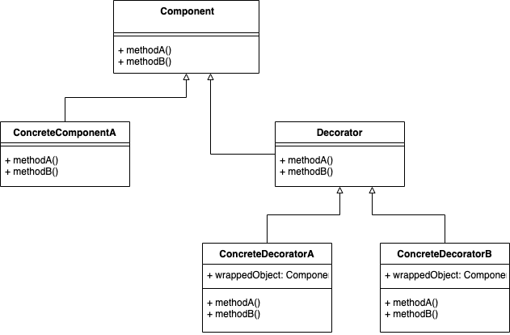
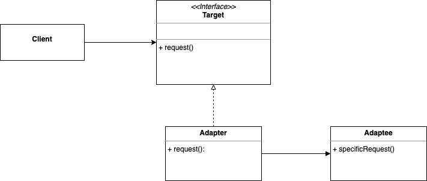

# 深入浅出设计模式

## 策略模式 Strategy Pattern
放在介绍章来讲确实很好理解，而且看完后也在工作的项目中用起来了，主要是可维护性强，
添加新算法只需要再写一个实现了`Strategy`的类即可，其他地方的代码都不需要改变。
### 定义
> **The Strategy Pattern** defines a family of algorithms, encapsulates each one, and makes them interchangeable.
> Strategy lets the algorithm vary independently from clients that use it.
### Class Diagram

## 观察者模式 Observer Pattern
### 定义
> **The Observer Pattern** defines a one-to-many dependency between objects so that when one obejct changes state, all of its dependents are notified and updated automatically.
### Class Diagram

## 装饰者模式 Decorator Pattern
感觉一直在强调程序要可以在`Runtime`下修改，而不是`compile`下。 Java I/O的相关类是使用了观察者模式
### 定义 
> **The Decorator Pattern** attaches additional responsibilities to an object dynamically. Decorators provide a flexible alternative to subclassing for extending functionality.

### Class Diagram

## 工厂模式
这一章太长了。。上次没看完，就不想继续看了。。随缘看吧

## 单例模式
### 定义
> **The Singleton Pattern** ensures a class has only one instance, and provides a global point of access to it.
 
注意单线程和多线程下单例模式的不同实现。

## 命令模式
### 定义
> **The Command Pattern** encapsulates a request as an object, thereby letting you parameterize other objects with different requests, queue or log requests, and support undoable operations.

## 适配者模式
### 定义
> **The Adapter Pattern** converts the interface of a class into another interface the clients expect. Adapter lets classes work together that couldn't otherwise because of incompatible interfaces.

### Class Diagram

### 举个例子
老版本的Java使用Enumeration，新版本Java使用Iterator，统一使用Iterator时，要对Enumeration进行适配。

## 门面模式 Facade Pattern
门面模式是简化接口，适配者模式是转化接口。
### 定义 
> **The Facade Pattern** provides a unified interface to a set of interfaces in a subsystem. Facade defines a higher-level interface that makes the subsystem easier to use.